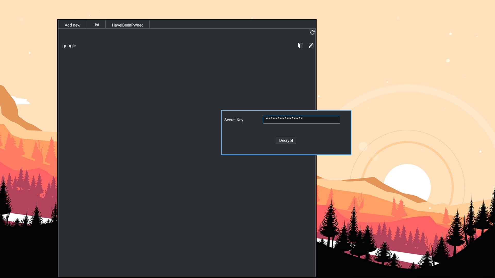
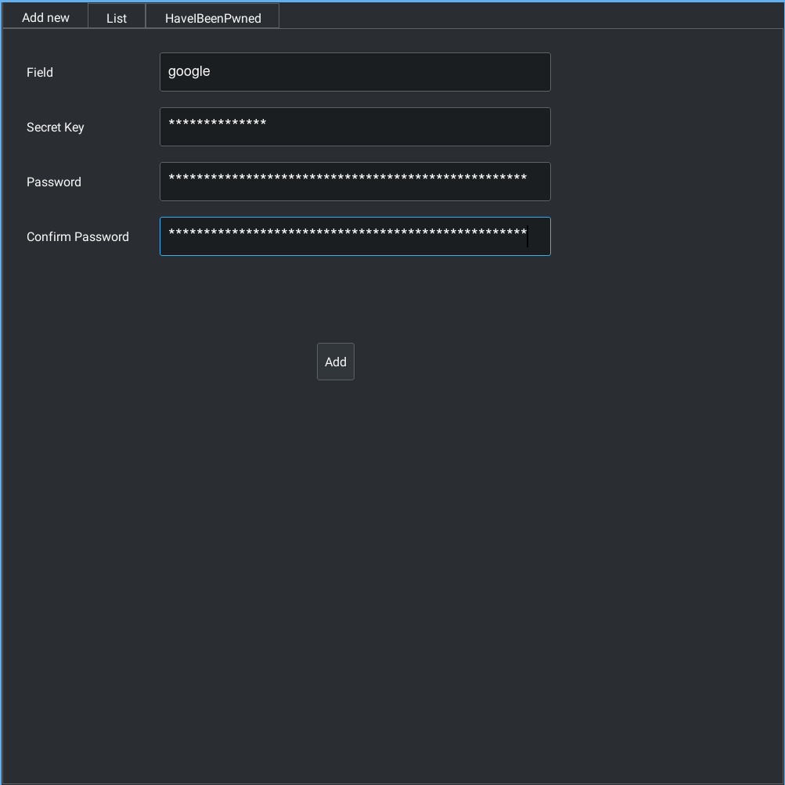

> Password Manager written in JAVA





# Features
- Uses the AES encryption algorithm
- Can pull breach data from [https://haveibeenpwned.com](HaveIBeenPwned) api
- Can output to stout(opens up a whole new world of possibilities)

# Setup
```bash
$ git clone https://github.com/Murtaza-Udaipurwala/password_manager_in_java
$ cd password_manager_in_java/
```

## Using and IDE(Eclipse/IntelliJ IDEA)
1. Import this project
2. Tell your IDE about all the dependencies by pointing it to the lib/ directory
3. Build and run it

#### OR

## Without using an IDE(Linux/OSX only)
#### Compile
```bash
$ javac -cp :./lib:./lib/json-simple-1.1.1.jar src/passwordmanager/Main.java src/passwordmanager/gui/*.java
```

#### Edit MANIFEST.MF
- Set `Class-Path` to absolute path of lib/json-simple-1.1.1.jar
Eg: `Class-Path: /home/username/projects/password_manager_in_java/lib/json-simple-1.1.1.jar`

#### Build the jar
```bash
$ jar cmf MANIFEST.MF passwordmanager.jar src/passwordmanager/* lib/*.jar
```

## Make `java swing` use your desktop environment theme
- Export _JAVA_OPTIONS environment variable
```bash
export _JAVA_OPTIONS="-Dawt.useSystemAAFontSettings=on -Dswing.aatext=true -Dswing.defaultlaf=com.sun.java.swing.plaf.gtk.GTKLookAndFeel -Dswing.crossplatformlaf=com.sun.java.swing.plaf.gtk.GTKLookAndFeel ${_JAVA_OPTIONS}"
```

# Usage
1. To launch GUI
```bash
$ java -jar passwordmanager.jar
```

2. Get help
```bash
$ java -jar passwordmanager.jar help
```

3. List all the entries
```bash
$ java -jar passwordmanager.jar ls

google
email
```

4. Insert a new entry
- The `secret key` used to encrypt and decrypt passwords. Keep it same for all the entries to make it act like a `master password`.
```bash
$ java -jar passwordmanager.jar insert google # here google is the field name

Enter secret key:
Password:
confirm Password:
```

5. Delete an entry
```bash
$ java -jar passwordmanager.jar delete google
```

6. Get information about breaches
```bash
$ java -jar passwordmanager.jar breach facebook # pulling from haveIbeenpwned api

PwnCount:     509458528
BreachDate:     2019-08-01
IsVerified:     true
Domain:     facebook.com
Name:     Facebook
```

# Extend with shell scripts
- Since passwordmanager can output to stdout you can pipe it's output to external programs like dmenu

- Example:
    * The following shell script takes output of passwordmanager and pipes it into dmenu
    * The user can then select the field and passwordmanager will prompt them for the secretKey
    * If entered correctly, the decrypted password will be copied to user's clipboard
    ```bash
    #!/bin/sh
    list="$(java 2>/dev/null -jar passwordmanager.jar ls)"
    selected="$(echo "$list" | dmenu -i)"
    java 2>/dev/null -jar passwordmanager.jar ls -gui "$selected" | xclip -selection clipboard
    ```

# TODO
- [x] Improve error handling
- [x] implement a gui using `swing`
- [x] get response from haveIbeenpwned api in a seperate thread.
- [ ] Test it on windows OS(Currently only tested on GNU/Linux)

# Disclaimer
- This is a university project. It solely exists to provide a learning experience.
- There might be potential lurking bugs.
- Please donot use this for anything but a reference. Murtaza Udaipurwala shall not be held responsible for your loses.
